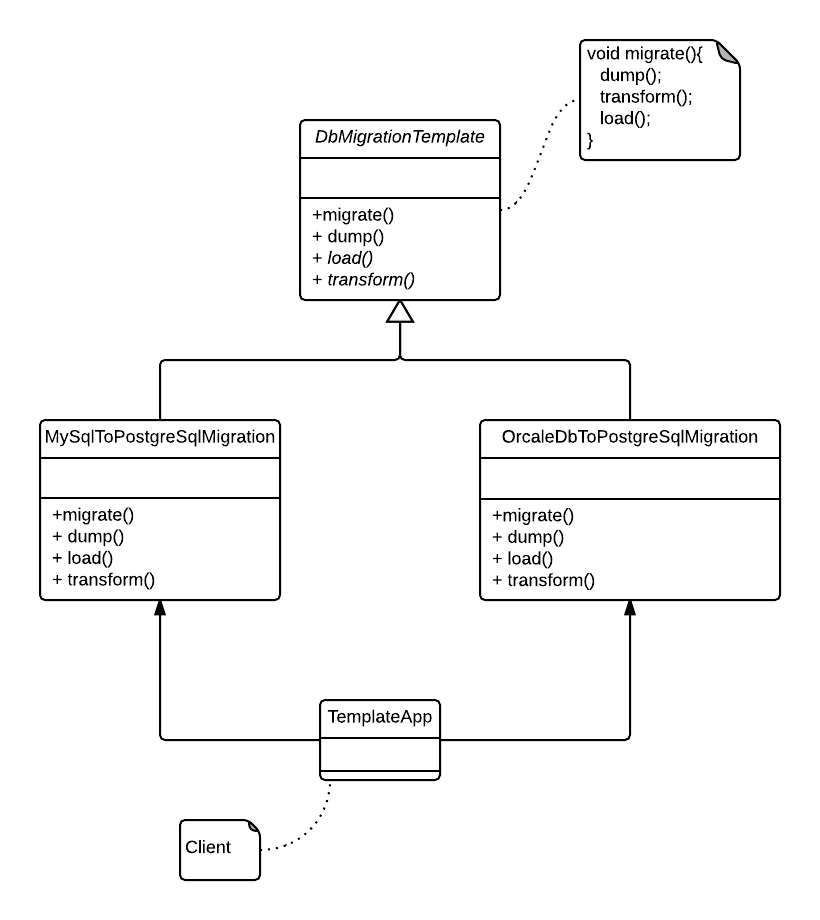

### Template pattern

#### A behavioral pattern

Defines common steps to execute an algorithm through subclasses, sometime providing a common implementation as well.

Source code stems from the following UML diagram:

